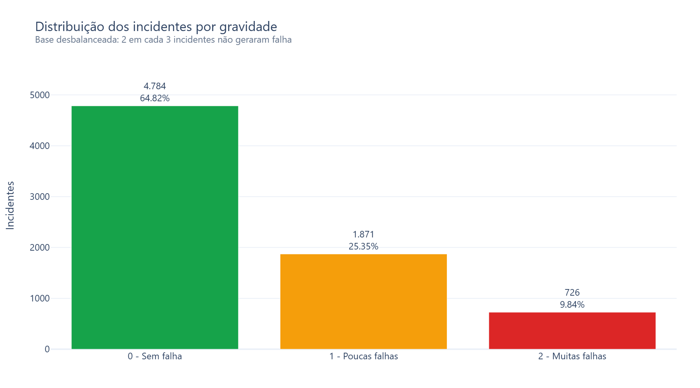
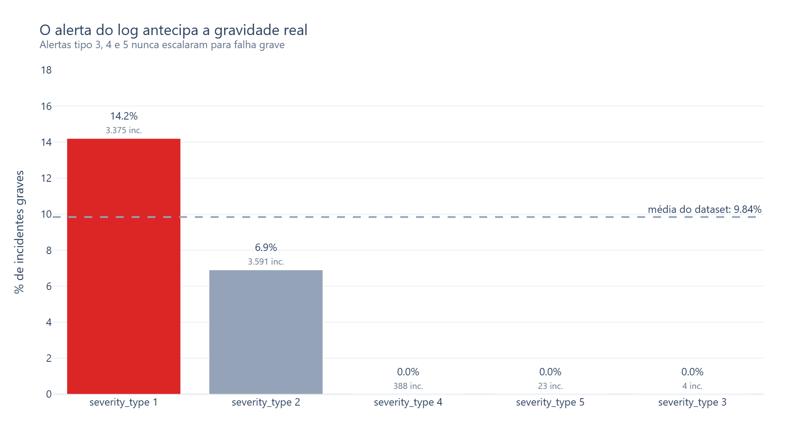
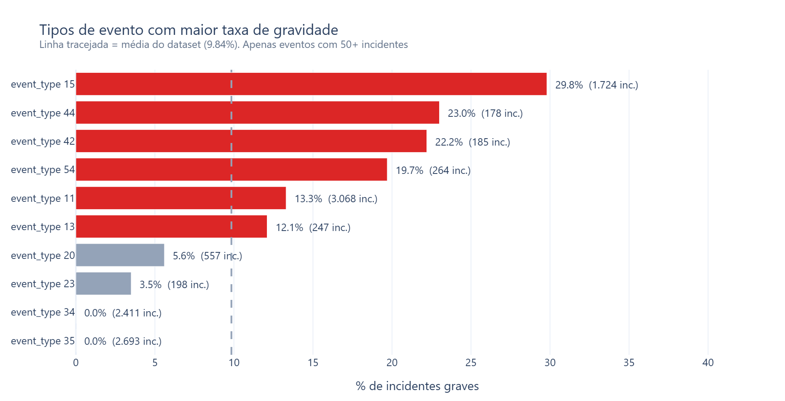
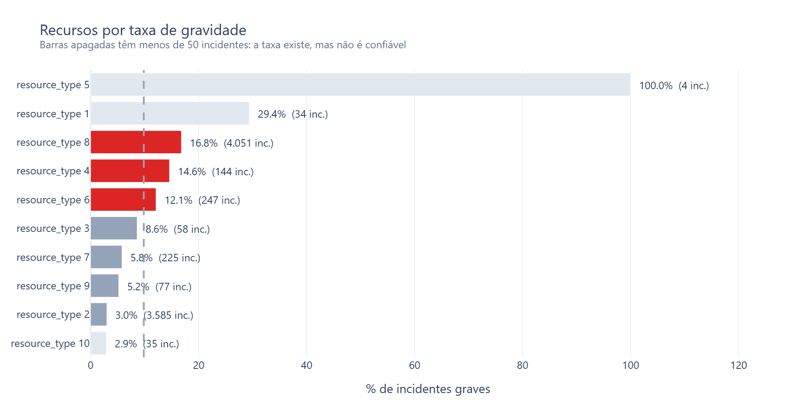
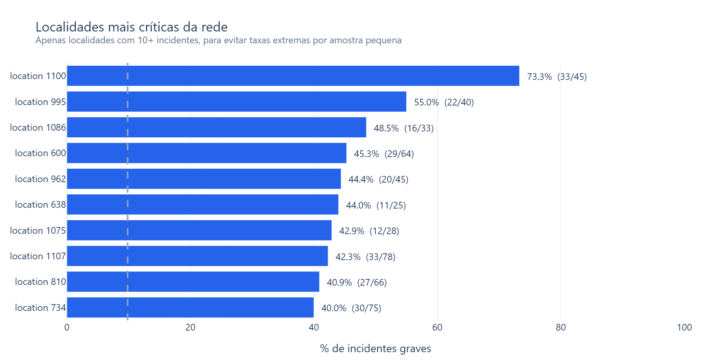
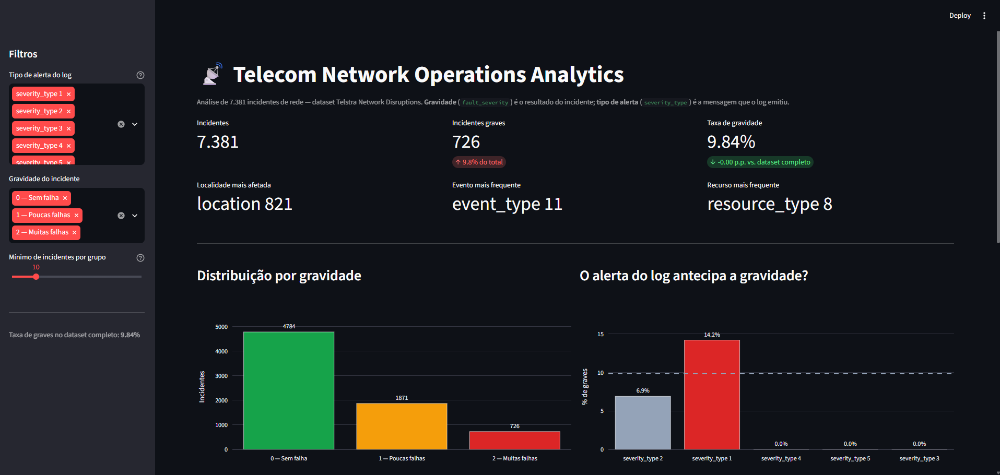

# Telecom Network Analysis

> 🚧 **Projeto em andamento** — 6 de 8 etapas concluídas. Veja o [andamento](#andamento).

Análise de incidentes e falhas de rede de uma operadora de telecomunicações,
usando Python, Pandas, SQL e SQLite, com dashboard em Streamlit.

---

## Problema de negócio

Uma equipe de **Network Operations** recebeu o histórico de incidentes de uma
rede de telecomunicações e precisa responder:

- Onde a rede falha mais?
- Quais recursos e tipos de evento concentram os incidentes graves?
- É possível prever a gravidade de um incidente a partir do alerta que o log emitiu?

---

## Dataset

**[Telstra Network Disruptions](https://www.kaggle.com/competitions/telstra-recruiting-network)**
(Kaggle, 2015) — 7 arquivos CSV, ~3 MB, dado real e público de uma operadora australiana.

| Arquivo | Linhas | Conteúdo |
|---|---:|---|
| `train.csv` | 7.381 | incidente, localidade e **gravidade** (`fault_severity`) |
| `severity_type.csv` | 18.552 | tipo do alerta emitido pelo log |
| `event_type.csv` | 31.170 | tipos de evento por incidente |
| `resource_type.csv` | 21.076 | recursos envolvidos |
| `log_feature.csv` | 58.671 | features de log e volume |
| `test.csv` | 11.171 | sem gravidade — **não usado** |
| `sample_submission.csv` | 11.171 | template Kaggle — **não usado** |

### Universo de análise: 7.381 incidentes

`fault_severity` — a variável que o projeto se propõe a explicar — existe apenas
em `train.csv`. Os 11.171 incidentes de `test.csv` eram o conjunto oculto de
avaliação da competição e nunca tiveram o gabarito publicado. Como todas as
perguntas de negócio envolvem gravidade, a análise usa somente os incidentes
com desfecho conhecido.

### Duas colunas parecidas que significam coisas diferentes

| | `fault_severity` | `severity_type` |
|---|---|---|
| O que é | **resultado** do incidente | tipo da mensagem de alerta do log |
| Valores | 0 (sem falha), 1 (poucas), 2 (muitas) | 5 categorias |
| Papel | variável-alvo | atributo de entrada |

Tratar `severity_type` como gravidade produziria números plausíveis e conclusões
inteiramente falsas. É a principal armadilha deste dataset.

### Limitações

1. **Não há data ou hora** em nenhum arquivo → sem análise temporal, sazonalidade ou MTTR.
2. **Categorias anonimizadas** (`event_type 11`, `location 821`) → conclusões ficam
   no nível de padrão estatístico, nunca de causa física.
3. **60% dos incidentes sem rótulo** → descartados.
4. **Sem duração, custo ou clientes afetados** → impossível priorizar por impacto financeiro.

---

## Tecnologias

| Camada | Ferramenta |
|---|---|
| Linguagem | Python 3.13 |
| Manipulação de dados | pandas, numpy |
| Banco de dados | SQLite (`sqlite3`, biblioteca padrão) |
| Armazenamento intermediário | Parquet |
| Visualização | Plotly |
| Dashboard | Streamlit |
| Testes | pytest |

---

## Pipeline

```
data/raw/*.csv          dataset original, nunca modificado
      ↓  data_loader.py       lê e valida o contrato dos dados
      ↓  cleaning.py          recorta o universo, converte texto → número
      ↓  transformation.py    monta o modelo dimensional
data/processed/*.parquet
      ↓  database.py          cria o banco e carrega as tabelas
database/telecom.db
      ↓  analysis_queries.sql consultas analíticas
      ↓  visualization.py     gráficos → reports/figures/*.png
      ↓  dashboard/app.py     dashboard interativo (Streamlit)
```

Um único ponto de entrada — `python run_pipeline.py` — reconstrói tudo do zero.

---

## Modelo do banco

**Star schema** com 9 tabelas: uma tabela fato, cinco dimensões e três tabelas-ponte
(porque um incidente pode ter vários eventos, recursos e features de log).

```
                  locations        severity_types
                       \                /
  event_types --- [incident_events] --- INCIDENTS --- [incident_resources] --- resource_types
                                            |
                                  [incident_log_features]
                                            |
                                      log_features
```

| Tipo | Tabela | Linhas |
|---|---|---:|
| Fato | `incidents` | 7.381 |
| Dimensão | `locations` | 929 |
| Dimensão | `event_types` | 49 |
| Dimensão | `log_features` | 331 |
| Dimensão | `resource_types` | 10 |
| Dimensão | `severity_types` | 5 |
| Ponte | `incident_log_features` | 23.851 |
| Ponte | `incident_events` | 12.468 |
| Ponte | `incident_resources` | 8.460 |

### Dicionário de dados

**`incidents`** — uma linha por incidente

| Coluna | Descrição |
|---|---|
| `incident_id` | identificador único do incidente |
| `location_id` | onde ocorreu → `locations` |
| `severity_type_id` | tipo de alerta emitido pelo log → `severity_types` |
| `fault_severity` | **resultado**: 0 sem falha, 1 poucas falhas, 2 muitas falhas |

**Tabelas-ponte** — existem porque um incidente pode ter várias ocorrências de cada

| Tabela | Colunas | Responde |
|---|---|---|
| `incident_events` | `incident_id`, `event_type_id` | **o que** foi registrado |
| `incident_resources` | `incident_id`, `resource_type_id` | **o que** estava envolvido |
| `incident_log_features` | `incident_id`, `log_feature_id`, `volume` | **quanto** o log mediu |

**Tabelas de dimensão** — traduzem o identificador no rótulo original do dataset
(`79` → `"location 79"`): `locations` (929), `event_types` (49),
`log_features` (331), `resource_types` (10), `severity_types` (5).

### Um incidente por inteiro

```
INCIDENTE 20
  onde ocorreu ........... location 79
  alerta do log .......... severity_type 2
  resultado .............. fault_severity 0  (não gerou falha)

  eventos registrados .... event_type 10, event_type 11, event_type 54
  recursos envolvidos .... resource_type 2, resource_type 3, resource_type 8
  medições do log ........ feature 39 (volume 1), feature 55 (volume 1)
```

Comparando com um chamado de manutenção: `location` é o endereço, `event_type` é
o que foi relatado, `resource_type` é o equipamento envolvido, `log_feature` são
as medições, e `fault_severity` é como o chamado terminou.

**As categorias são anonimizadas.** Sabemos que o `event_type 11` aparece em 3.068
incidentes, mas não o que ele representa fisicamente na rede. Por isso as
conclusões deste projeto são padrões estatísticos, nunca relações de causa.

---

## Resultados parciais

> Todos os números abaixo são calculados a partir dos dados, por
> [`sql/analysis_queries.sql`](sql/analysis_queries.sql). Nenhum é estimado.

**Taxa base de incidentes graves no dataset: 9,84%.**

### A base é desbalanceada



Dois em cada três incidentes não geraram falha alguma. Isso importa porque um
ranking por **contagem** de incidentes graves apenas reproduziria o ranking de
volume total — por isso as análises abaixo usam **taxa**.

### 1. O alerta do log antecipa a gravidade real



O `severity_type 4` tem **388 incidentes e nenhum grave**. Na taxa base
esperaríamos ~38. Zero em 388 não é acaso de amostra pequena.

Operacionalmente: alertas do tipo 1 merecem prioridade sobre os do tipo 2, e os
tipos 3, 4 e 5 nunca escalaram.

### 2. O tipo de evento separa bem o que vira problema



O `event_type 15` tem **29,8%** de graves — três vezes a média. Já os tipos 35 e
34, juntos presentes em mais de 5 mil incidentes, **nunca** geraram falha grave.

### 3. Dois recursos dominam, com risco 5x diferente



`resource_type 8` aparece em 4.051 incidentes com **16,8%** de graves;
`resource_type 2` aparece em 3.585 com apenas **3,0%**. Volume parecido, risco
muito diferente.

As barras apagadas têm menos de 50 incidentes. O `resource_type 5` marca 100%,
mas são **4 incidentes** — a taxa existe e não é confiável.

### 4. Localidades críticas, com amostra mínima



Sem corte mínimo, 14 localidades marcariam 100% de gravidade — **10 delas com um
único incidente**. Exigindo 10 incidentes, o topo passa a ser `location 1100`
(33 graves em 45, **73,3%**), mais de 7× a taxa base.

O top 5 é **idêntico** nos cortes de 10 e de 30: o ranking é robusto e não
depende do corte escolhido.

---

## Andamento

| # | Etapa | Status |
|---|---|---|
| 1 | Ambiente + dataset | ✅ concluído |
| 2 | Análise exploratória | ✅ concluído |
| 3 | Limpeza + transformação | ✅ concluído |
| 4 | SQLite + consultas SQL | ✅ concluído |
| 5 | Análise + visualizações | ✅ concluído |
| 6 | Dashboard Streamlit | ✅ concluído |
| 7 | Testes + documentação | ⬜ próximo |
| 8 | Revisão final | ⬜ |

**Concluído:** pipeline reproduzível de ponta a ponta, do CSV bruto até os
gráficos; notebook de exploração; 7 consultas SQL analíticas; 5 visualizações;
dashboard interativo; 56 testes automatizados.

**A fazer:** revisão final da documentação.

---

## Dashboard



```bash
streamlit run dashboard/app.py
```

Abre em `http://localhost:8501`.

**Como funciona:** o dashboard carrega os dados do SQLite **uma vez** (com
`@st.cache_data`) e a partir daí filtra em memória com pandas. SQL faz o trabalho
pesado de junção no início; pandas cuida da interação, que precisa ser instantânea.

**Filtros** — tipo de alerta do log, gravidade do incidente, e um controle de
**amostra mínima por grupo**. Vale mover esse último para 1 e observar o ranking
de localidades encher de taxas de 100%: é a demonstração interativa de por que o
corte existe.

**KPIs** — total de incidentes, incidentes graves, taxa de gravidade comparada
com a do dataset completo, e as categorias mais frequentes. Todos reagem aos
filtros.

**Abas** — rankings de localidades, eventos e recursos por taxa de gravidade,
com a mesma leitura visual dos gráficos acima: vermelho acima da média, cinza
abaixo, apagado quando a amostra é pequena demais para confiar.

---

## Estrutura

```
├── data/
│   ├── raw/                    dataset original (versionado)
│   └── processed/              Parquet gerado pelo pipeline
├── database/telecom.db         SQLite gerado pelo pipeline
├── notebooks/
│   └── exploratory_analysis.ipynb
├── dashboard/
│   └── app.py                  dashboard Streamlit
├── sql/
│   ├── schema.sql              estrutura das tabelas
│   └── analysis_queries.sql    consultas analíticas
├── src/
│   ├── config.py               caminhos, constantes e logging
│   ├── data_loader.py          leitura e validação do dado bruto
│   ├── cleaning.py             recorte de universo e conversão de tipos
│   ├── transformation.py       modelo dimensional
│   ├── database.py             SQLite: criação, carga e consultas
│   └── visualization.py        gráficos Plotly
├── reports/figures/            gráficos gerados (PNG)
├── tests/                      56 testes (pytest)
├── run_pipeline.py             ponto de entrada
├── LEARNING_NOTES.md           notas de estudo do desenvolvedor
└── requirements.txt
```

---

## Instalação

```bash
git clone https://github.com/andre-tchagas/telecom-network-analysis.git
cd telecom-network-analysis

python -m venv .venv
.venv\Scripts\activate          # Windows
source .venv/bin/activate       # Linux / macOS

pip install -r requirements.txt
```

O dataset já está versionado em `data/raw/`, então não é preciso baixar nada.

## Como executar

```bash
python run_pipeline.py
```

Lê os CSVs, valida, limpa, transforma, grava os Parquet e reconstrói o banco
SQLite do zero.

## Testes

```bash
pytest
```

---

## Melhorias futuras

- Substituir o corte mínimo por *shrinkage* (encolhimento em direção à média),
  estatisticamente mais correto para ranking com amostras desiguais.
- Modelo de classificação para prever `fault_severity`.
- Migrar de SQLite para PostgreSQL, caso o volume cresça.

---

## Sobre

Projeto de portfólio desenvolvido para praticar Python, Pandas, SQL e
visualização de dados aplicados ao domínio de telecomunicações.

Desenvolvido com apoio de IA (Claude Code) como ferramenta de implementação;
todas as decisões técnicas, análises e interpretações estão documentadas em
[`LEARNING_NOTES.md`](LEARNING_NOTES.md).
